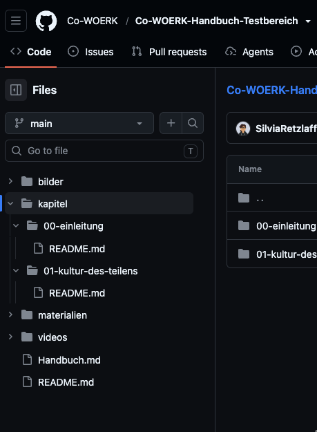
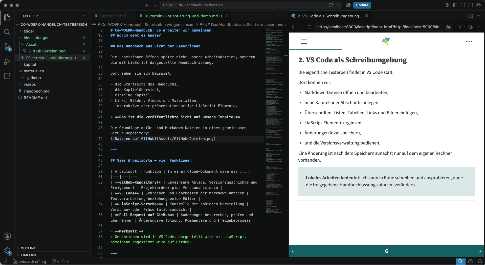

<!--
author: Co-WOERK
language: de
version: 0.1.0
title: Co-WOERK-Handbuch – Orientierung und Demo
comment: Termin 1: Arbeitsorte, Grundprinzipien und Zusammenarbeit
-->

# Co-WOERK-Handbuch: So arbeiten wir gemeinsam
Hier lernt ihr die Grundlagen kennen, eine Klickanleitung für die Software findet ihr im Abschnitt 2 (aktuell noch nicht verfügbar).

## Worum geht es heute?

Heute geht es noch **nicht** darum, dass alle sofort selbst mit Git und GitHub (*das ist der Ort, an dem LiaScript-Inhalte gespeichert werden*) arbeiten.

Wir schaffen zunächst ein gemeinsames Bild davon,

- wo das Handbuch liegt,
- wo wir Texte schreiben,
- wie wir Änderungen gemeinsam besprechen, prüfen und übernehmen,
- und wie LiaScript daraus die sichtbare Handbuchfassung erzeugt.

> **Ziel des Termins:**  
> Am Ende können alle erklären, welcher Arbeitsort welche Funktion hat und wie eine Änderung vom ersten Entwurf bis in die freigegebene Handbuchfassung gelangt.

---

## Das Handbuch aus Sicht der Leser:innen

Die Leser:innen öffnen später nicht unsere Arbeitsdateien, sondern die mit LiaScript dargestellte Handbuchfassung.

Dort sehen sie zum Beispiel:

- die Startseite des Handbuchs,
- die Kapitelübersicht,
- einzelne Kapitel,
- Links, Bilder, Videos und Materialien,
- interaktive oder präsentationsartige LiaScript-Elemente.

> **Das ist die veröffentlichte Sicht auf unsere Inhalte.**

Die Grundlage dafür sind Markdown-Dateien in einem gemeinsamen GitHub-Repository:

---

## Vier Arbeitsorte – vier Funktionen

| Arbeitsort | Funktion | In einem Cloud-Dokument wäre das ... |
|---|---|---|
| **GitHub-Repository** | Gemeinsame Ablage, Versionsgeschichte und Freigabeort | Projektordner plus Versionshistorie |
| **VS Code** | Schreiben und Bearbeiten der Markdown-Dateien | Textverarbeitung beziehungsweise Editor |
| **LiaScript-Vorschau** | Kontrolle der späteren Darstellung | Vorschau- oder Präsentationsansicht |
| **Pull Request auf GitHub** | Änderungen besprechen, prüfen und übernehmen | Änderungsverfolgung, Kommentare und Freigabeprozess |

> **Merksatz:**  
> Geschrieben wird in VS Code, dargestellt wird mit LiaScript, gemeinsam abgestimmt wird auf GitHub.

---

## 1. Das GitHub-Repository

Das Repository ist der gemeinsame Projektraum für das Handbuch.

Dort liegen unter anderem:

- die zentrale Datei `Handbuch.md`,
- die Kapitel im Ordner `kapitel/`,
- Bilder und andere Medien,
- Materialien zum Download,
- die vollständige Änderungshistorie.

Der Branch `main` enthält den aktuell freigegebenen Stand.

> **`main` ist unsere verbindliche Hauptfassung.**

In `main` wird nicht spontan oder nebenbei gearbeitet. Neue oder überarbeitete Inhalte werden zunächst in einem eigenen Arbeitsbranch vorbereitet.

---

## 2. VS Code als Schreibumgebung

Die eigentliche Textarbeit findet in VS Code statt.

Dort können wir:

- Markdown-Dateien öffnen und bearbeiten,
- neue Kapitel oder Abschnitte anlegen,
- Überschriften, Listen, Tabellen, Links und Bilder einfügen,
- LiaScript-Elemente ergänzen,
- Änderungen lokal speichern,
- und die Versionsverwaltung bedienen.

Eine Änderung ist nach dem Speichern zunächst nur auf dem eigenen Rechner vorhanden.

> **Lokales Arbeiten bedeutet:**  
> Ich kann in Ruhe schreiben und ausprobieren, ohne die freigegebene Handbuchfassung sofort zu verändern.

So sieht das aus: 

---

## 3. LiaScript als Vorschau und Darstellungsform

LiaScript liest unsere Markdown-Dateien und stellt sie als navigierbares, medienreiches Dokument dar.

Während des Schreibens können wir die lokale LiaScript-Vorschau öffnen und direkt prüfen:

- Sind die Überschriften sinnvoll gegliedert?
- Funktionieren Links und Bilder?
- Werden Tabellen und Medien korrekt angezeigt?
- Ist der Abschnitt als Handbuchseite verständlich?
- Passt die Darstellung zu unserer inhaltlichen Absicht?

> **Die Vorschau zeigt das Ergebnis, ohne dass vorher ein Commit oder eine Veröffentlichung nötig ist.**

So sieht das aus: 

---

## 4. Der Pull Request als Ort der Zusammenarbeit

Wenn ein Arbeitsstand bereit für die gemeinsame Prüfung ist, wird er als Pull Request eingereicht.

Ein Pull Request zeigt:

- welche Dateien geändert wurden,
- welche Textstellen neu oder überarbeitet sind,
- wer die Änderung eingebracht hat,
- welche Kommentare und Rückfragen es gibt,
- ob noch Überarbeitungen notwendig sind,
- und ob die Änderung freigegeben wurde.

> **Ein Pull Request ist kein fertiges Endprodukt.**  
> Er ist der Raum, in dem ein Änderungsvorschlag gemeinsam geprüft und weiterentwickelt wird.

---

## Von der Idee zur freigegebenen Fassung

Der grundlegende Ablauf sieht so aus:

1. Eine Person erstellt eine Arbeitsfassung (Branch genannt) für sich selbst.
2. Sie bearbeitet eine oder mehrere Dateien in VS Code.
3. Sie prüft die Darstellung in LiaScript.
4. Sie speichert einen nachvollziehbaren Arbeitsstand (Commit genannt).
5. Sie überträgt den Branch zu GitHub.
6. Sie eröffnet eine Aufgabe den Arbeitsstand mit der Hauptfassung des Handbuchs (main genannt) zusammenzuführen (Pull Request genannt).
7. Eine andere Person kommentiert, macht Vorschläge oder fordert Änderungen an.
8. Die Autorin oder der Autor überarbeitet den Text.
9. Eine andere Person gibt die Änderung frei.
10. Der Pull Request wird in `main` übernommen.

> **Erst nach dem Merge gehört die Änderung zur freigegebenen Handbuchfassung.**

---

## Bekannte Begriffe neu übersetzt

| Git/GitHub | Bedeutung für unsere Zusammenarbeit |
|---|---|
| **Repository** | Gemeinsamer Projektordner mit Versionsgeschichte |
| **`main`** | Freigegebene Hauptfassung |
| **Branch** | Arbeitskopie für eine konkrete Änderung |
| **Commit** | Benannter Speicherstand |
| **Push** | Eigene Änderungen zu GitHub übertragen |
| **Pull Request** | Änderungen zur Prüfung vorlegen |
| **Review-Kommentar** | Rückfrage oder Hinweis an einer Änderung |
| **Suggestion** | Direkt formulierter Änderungsvorschlag |
| **Request changes** | Überarbeitung anfordern |
| **Approve** | Änderung freigeben |
| **Merge** | Änderung in die Hauptfassung übernehmen |
| **History** | Nachvollziehbare Versionsgeschichte |

---

## Ein wichtiger Unterschied zu Word und Cloud-Dokumenten

Wir arbeiten nicht dauerhaft gleichzeitig in derselben freigegebenen Datei.

Stattdessen gilt:

- Jede konkrete Änderung entsteht zunächst in einem eigenen Branch.
- Die Hauptfassung bleibt währenddessen stabil.
- Unterschiede werden im Pull Request sichtbar.
- Kommentare bleiben direkt an der Änderung dokumentiert.
- Überarbeitungen können nachvollzogen werden.
- Erst geprüfte Änderungen werden in `main` übernommen.

Das ist zunächst weniger unmittelbar als gemeinsames Live-Schreiben, bietet aber mehr Kontrolle über die freigegebene Fassung.

---

## Kommentare im Pull Request

Kommentare eignen sich für Rückfragen, Hinweise und inhaltliche Diskussionen.

Beispiele:

> Sollten wir hier deutlicher zwischen OER und OEP unterscheiden?

> Ist dieser Begriff bereits an anderer Stelle definiert?

> Brauchen wir für diese Aussage noch ein konkretes Praxisbeispiel?

> Passt dieser Abschnitt in dieses Kapitel oder eher in den Bereich Communityarbeit?

Ein Kommentar muss nicht sofort eine fertige Lösung enthalten. Er macht sichtbar, was noch geklärt werden sollte.

---

## Konkrete Änderungsvorschläge

GitHub erlaubt es, direkt an einer Textstelle eine **Suggestion** zu formulieren.

Beispiel:

> OER und OEP werden in diesem Kapitel als miteinander verbundene, aber unterschiedliche Konzepte behandelt.

Die Autorin oder der Autor kann diesen Vorschlag:

- direkt übernehmen,
- verändert übernehmen,
- ablehnen,
- oder zunächst mit den anderen Beteiligten diskutieren.

> **Suggestion bedeutet:**  
> Ich beschreibe nicht nur ein Problem, sondern biete bereits eine konkrete Formulierung an.

---

## Review und Freigabe

Nach der inhaltlichen Prüfung gibt es drei typische Reaktionen:

### Comment

Es gibt Hinweise oder Rückfragen, aber noch keine abschließende Bewertung.

### Request changes

Vor der Freigabe sind konkrete Überarbeitungen notwendig.

### Approve

Die Änderung ist aus Sicht der prüfenden Person bereit für die Übernahme.

Für unser Handbuch gilt das Vier-Augen-Prinzip:

> **Eine Person bringt die Änderung ein, mindestens eine andere Person prüft und genehmigt sie.**

Offene Diskussionen werden vor dem Merge geklärt.

---

## Demonstration (optional)

Ich zeige einmal den vollständigen Weg:

1. die öffentliche LiaScript-Fassung,
2. das Repository und seine Ordnerstruktur,
3. eine Markdown-Datei in VS Code,
4. eine kleine Textänderung,
5. die lokale LiaScript-Vorschau,
6. einen Arbeitsbranch,
7. einen Commit und das Übertragen zu GitHub,
8. den Pull Request,
9. einen Kommentar,
10. eine konkrete Suggestion,
11. die Freigabe und den Merge.

Heute geht es dabei um das **Verstehen des Ablaufs**, nicht um das Auswendiglernen einzelner Klicks.

---

## Abschlussfrage

Was wir jetzt klären sollten:

- Was wirkt bereits verständlich?
- Welche Begriffe sind noch unklar?
- Welche Schritte erscheinen unnötig kompliziert?
- Welche Unterstützung braucht ihr wenn ihr das selbst durchgeht?
- Welche Regeln müssen wir für unsere gemeinsame Textarbeit noch präzisieren?
